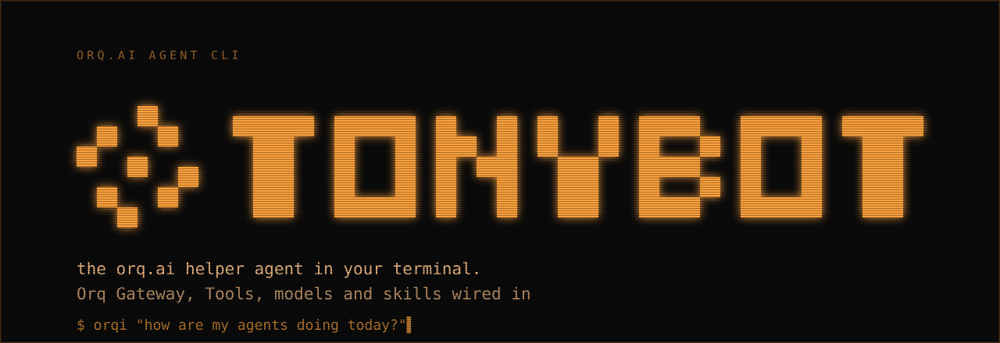
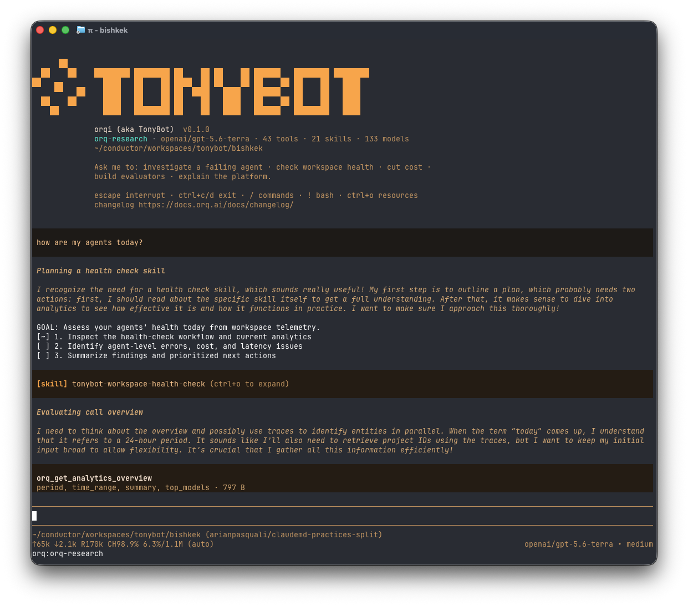

> **Alpha.** Under active development. Expect rough edges and breaking changes.

**orqi** (aka TonyBot) is the orq.ai helper agent in your terminal. Ask it to investigate a failing
agent, check workspace health, cut cost, build evaluators, or explain the platform, and it answers
with your workspace's own tools, models and skills already wired in. No setup, no glue code.

It embeds the [pi coding agent](https://github.com/earendil-works/pi) in-process and boots with the
orq MCP tools, the orq skills and the orqi system prompt already wired in.



```
orqi                                   # interactive TUI
orqi "why did my agent fail today?"    # one-shot, prints and exits
```

## Install

```bash
curl -fsSL https://raw.githubusercontent.com/orq-ai/orqi/main/install.sh | sh
```

Pulls the latest release binary, no clone, no Bun.

Then authenticate once with either the [orq CLI](https://github.com/orq-ai/orq-cli)
(`orq auth login`) or a valid `ORQ_API_KEY`. Keep the orq CLI on `PATH` either way: `/whoami`,
`/workspace` and `/doctor` shell out to it.

```bash
orqi update             # replace this binary with the latest release
```

orqi checks once a day and surfaces a header note when a newer release exists; `orqi update` itself
never runs automatically.

## What it ships with builtin

| | |
|---|---|
| **orq AI Router** | The only model provider, so `/model` offers exactly the models the workspace has enabled |
| **5 workspace commands** | `/tools`, `/whoami`, `/workspace [key]`, `/doctor`, `/whatsnew` (the orq.ai changelog) |
| **43 orq MCP tools** | Every tool the workspace's MCP server exposes today, minus three invocation surfaces ([why](ARCHITECTURE.md#tools)). Wrapped as native pi tools with an `orq_` prefix. Results render as a one-line summary (`23 items · 6.0 KB`); `ctrl+o` expands to pretty-printed JSON. The model always receives the full payload |
| **22 skills** | 15 from [orq-ai/assistant-plugins](https://github.com/orq-ai/assistant-plugins) plus the 7 orqi skills, vendored in `skills/`. The upstream 15 refresh themselves: orqi checks once a day and picks up new ones without waiting for a release |
| **3 subagents** | `investigator`, `analyst`, `docs`, in-process, each with a narrow orq tool subset |


Model calls route through the orq AI Router, registered as a single pi provider named `orq` whose
model list is the workspace's own enabled catalogue, so `/model` offers exactly what the workspace
allows and one orq credential covers both the LLM and the tools.

## Environment

| Variable | Purpose |
|---|---|
| `ORQ_API_KEY` | Credential; falls back to the `orq auth login` session when unset or rejected. Works on its own, no session file needed |
| `ORQ_PROFILE` | Which `orq auth login` session to read (default `default`) |
| `ORQI_MODEL` | Router model (default `openai/gpt-5.6-terra`) |
| `ORQI_TUI` | `regular` renders inline instead of fullscreen (fullscreen is upstream-experimental) |
| `ORQI_THEME` | `dark` selects the theme that keeps turquoise for success and red for errors; the default is one-hue amber. `/theme` switches mid-session |
| `ORQI_LOCAL_SKILLS` | Also discover skills installed on the machine (off by default; 100+ ambient skills would swamp the prompt) |
| `ORQI_ALL_TOOLS` | Set to `1` to also expose the invocation tools that are filtered out by default ([why](ARCHITECTURE.md#tools)) |
| `ORQI_SKILLS_UPDATE` | Set to `0` to pin skills to whatever the binary shipped with, disabling the daily check |
| `ORQI_UPDATE_CHECK` | Set to `0` to pin: no daily update check, no header notice. `orqi update` still works when run directly |
| `ORQI_REFRESH_TOOLS`, `ORQI_REFRESH_MODELS`, `ORQI_REFRESH_SKILLS`, `ORQI_REFRESH_UPDATE` | Refresh the cached tool / model catalogues, force a skills check, or force an update check now, ignoring the 24 h TTL |
| `ORQI_AGENT_DIR`, `ORQ_API_BASE_URL`, `ORQ_MCP_URL`, `ORQ_GATEWAY_URL` | Override the agent dir / endpoints (on-prem) |
| `ORQI_VERSION` | Pins the release tag: which one `install.sh` installs, and which one `orqi update` installs |
| `ORQI_INSTALL_DIR` | Read by `install.sh` only: where the binary lands (default `~/.local/bin`) |
| `CI` | A non-empty value suppresses the daily update check, same as `ORQI_UPDATE_CHECK=0` |

The CLI keeps its own agent dir (`~/.orqi/agent`) and never touches `~/.pi`.

## Build from source

```bash
bun install
bun run start           # or: bun link && orqi
bun test
```

Requires [Bun](https://bun.sh) and the [orq CLI](https://github.com/orq-ai/orq-cli) on `PATH`.

## Docs

- [ARCHITECTURE.md](ARCHITECTURE.md): how the pieces fit, how tools and models are wired, known
  rough edges.
- [AGENTS.md](AGENTS.md): working notes for changing the code, plus the release process.
- [SECURITY.md](SECURITY.md): what orqi downloads and executes, including the daily unsigned
  skills update and how to pin it.

---

MIT licensed. Built by [orq.ai research labs](https://orq.ai).
